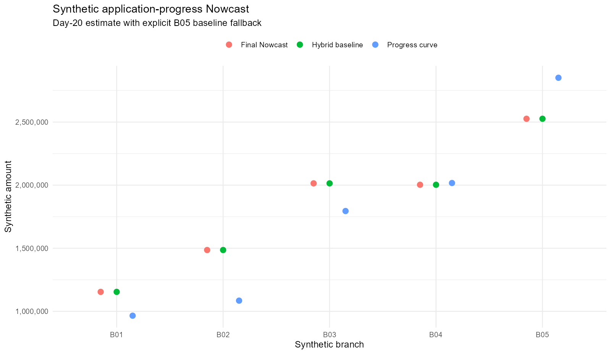
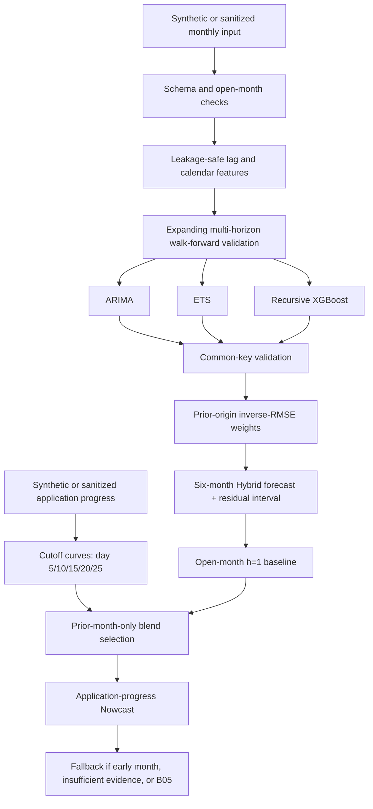

# Warranty Revenue Forecasting System

[](https://github.com/william4785-code/warranty-revenue-forecasting-system/actions/workflows/validation.yml)

Portfolio V2.3 is a governed R forecasting system for monthly warranty revenue
and intramonth application-progress nowcasting. It combines ARIMA, ETS, and
recursive XGBoost through leakage-safe walk-forward validation, adaptive Hybrid
weights, prediction intervals, and an explicit short-history fallback.

The project also records a negative Challenger result: dynamic nested XGBoost
tuning looked promising, but the selected fixed parameter set failed to
generalize on an untouched chronological holdout. The production Champion was
therefore retained.

> This is a sanitized portfolio implementation. All records, amounts, branch
> IDs, dates used by demos, database names, and outputs are synthetic. Public
> aliases B01-B05 do not map to real operating units.


## What V2.3 Adds

- Application-progress Nowcast at calendar-day cutoffs 5, 10, 15, 20, and 25
- Latest validated cutoff selection based on an explicit analysis date
- Branch progress curves shrunk toward a pooled prior
- Prior-month-only tuning of the baseline/curve blend weight
- Baseline-only behavior before day 5 and for unsupported branches
- A public B05 short-history fallback that demonstrates conservative routing
- Chronology audits for model training, Hybrid weights, and nowcast history
- Champion/Challenger promotion gates with an explicit retain decision
- Fully synthetic monthly and application-level data generation

V2.3 does not replace the six-month Hybrid forecast. It updates only the open
month's `h = 1` estimate when enough application-progress evidence exists.



## Architecture



## Forecasting Models

| Model | Role | Main control |
|---|---|---|
| ARIMA | Linear autocorrelation and differencing | Expanding-window evaluation |
| ETS | Level, trend, and seasonality | Same forecast keys as other models |
| XGBoost | Nonlinear lag and calendar effects | Forecast-time feature allowlist |
| Hybrid | Diversifies component errors | Weights use prior origins only |
| Nowcast | Blends h=1 baseline with observed application progress | Curves and weights use prior completed months |

Simple models remain valid Champions when a more complex learner fails the same
future-style evaluation.

## Walk-Forward Validation

The monthly system evaluates horizons `h = 1,...,6`. At each forecast origin:

1. Training data ends at the origin.
2. Every target date is later than the origin.
3. ARIMA, ETS, and XGBoost predict identical branch/date/horizon keys.
4. Missing or duplicated component predictions fail validation.
5. Hybrid weights use forecast origins strictly earlier than the evaluated row.
6. XGBoost recursively feeds predictions forward without using future actuals.

The Nowcast applies the same rule at a finer grain. A target month's progress
curve and blend weight can use only completed months before that target month.

See [Validation Methodology](docs/validation-methodology.md) and
[Leakage Controls](docs/leakage-controls.md).

## Hybrid and Short-History Fallback

Hybrid component weights are based on inverse walk-forward RMSE. Branch/horizon
weights are preferred when enough evidence exists; otherwise the system falls
back to branch-level evidence. Residual intervals are estimated from historical
Hybrid errors rather than assuming that component errors are independent.

Public alias `B05` represents the short-history fallback pattern. It keeps the
conservative recursive-core route and remains on the original Hybrid `h = 1`
forecast instead of receiving an unvalidated application-progress adjustment.

## Phase 4B / 4B.1 Challenger Evidence

### Phase 4B: Dynamic Nested Policy

The leakage-safe dynamic policy reselected one shared XGBoost parameter row at
each outer forecast origin. On common future-style keys it produced:

- XGBoost RMSE change: **-2.69%**
- XGBoost RMSE change excluding a stress month: **-8.97%**
- Leakage-safe Hybrid RMSE change: **-0.35%**
- Four of six horizons improved
- All five Nowcast cutoffs improved
- No established branch crossed the 5% degradation guardrail
- Short-history fallback remained unchanged

This was a policy-level promotion candidate, not evidence that one static
parameter row was deployable. Twelve outer folds selected seven different
candidates, and the all-history candidate was not an outer-fold winner.

### Phase 4B.1: Fixed Chronological Holdout

One candidate was selected on six earlier origins, frozen, and evaluated on six
untouched later origins. It failed the downstream promotion gates:

- XGBoost RMSE worsened **9.60%**
- Excluding the stress month, XGBoost still worsened **4.58%**
- Hybrid RMSE worsened **3.64%**
- Only two of six horizons improved
- Zero of five Nowcast cutoffs improved overall
- Two established branches breached the material-degradation guardrail
- The short-history fallback remained unchanged

Decision: **RETAIN V2.3**.

The result rejects this fixed Challenger; it does not claim that all future
XGBoost tuning is impossible. Full interpretation is in
[Challenger Validation](docs/challenger-validation.md). Sanitized aggregate
evidence is available under [`results/`](results/).

## Quick Start

Requirements:

- R 4.4 or later
- packages captured in `renv.lock`

```r
install.packages("renv")
renv::restore()
```

Run the complete synthetic V2.3 forecast and Nowcast:

```r
source("scripts/run_demo.R", encoding = "UTF-8")
```

The demo generates:

- synthetic monthly revenue for B01-B05;
- synthetic application-level progress records;
- six-month component and Hybrid forecasts;
- open-month application-progress Nowcast;
- baseline-only B05 fallback;
- Excel and PNG outputs under `outputs/demo/`.

Run the smaller synthetic fixed-Challenger experiment:

```r
source("scripts/run_challenger_demo.R", encoding = "UTF-8")
```

Synthetic outcomes demonstrate the validation mechanics and are not presented
as production accuracy.

## Run with Sanitized Data

Monthly CSV:

```text
date,branch_id,revenue
2025-01-01,B01,1250000
```

Optional application-progress CSV:

```text
application_id,branch_id,application_date,amount
SYN-B01-202501-0001,B01,2025-01-03,24000
```

```text
INPUT_CSV=path/to/monthly_input.csv
INPUT_APPLICATION_CSV=path/to/application_input.csv
ANALYSIS_AS_OF_DATE=2026-01-20
REPORT_OUTPUT_DIR=outputs
```

```r
source("scripts/run_forecast.R", encoding = "UTF-8")
```

MariaDB remains available for the generic monthly schema through
`.env.example`. Database publishing is not part of this repository.

## Project Structure

```text
.
├── R/
│   ├── config.R
│   ├── data_validation.R
│   ├── feature_engineering.R
│   ├── models.R
│   ├── backtesting.R
│   ├── hybrid.R
│   ├── nowcast.R
│   ├── challenger_validation.R
│   ├── metrics.R
│   ├── io.R
│   ├── pipeline.R
│   └── synthetic_data.R
├── scripts/
│   ├── run_forecast.R
│   ├── run_demo.R
│   └── run_challenger_demo.R
├── tests/testthat/
├── results/
│   ├── phase4b-public-summary.csv
│   └── promotion-gates-public.csv
├── docs/
│   ├── model-card.md
│   ├── validation-methodology.md
│   ├── feature-availability.md
│   ├── leakage-controls.md
│   ├── challenger-validation.md
│   └── data-dictionary.md
├── .github/workflows/validation.yml
├── CHANGELOG.md
└── renv.lock
```

## Tests

```r
source("tests/testthat.R", encoding = "UTF-8")
```

Tests cover schema validation, open-month exclusion, feature availability,
common evaluation keys, prior-origin Hybrid weights, application-progress
fallbacks, chronological splits, promotion-gate failure, and the synthetic
end-to-end forecast pipeline.

## Responsible Use

- V2.3 remains the Champion.
- Dynamic retuning remains an experimental policy.
- The evaluated fixed Challenger is rejected.
- Nowcast adjusts only the open-month h=1 forecast.
- Confidence intervals are empirical approximations and require monitoring.
- Synthetic outputs must not be interpreted as business performance.

## Privacy

Do not commit real claim records, revenue values, branch mappings, credentials,
database endpoints, operational feature names, model snapshots, checkpoints,
row-level predictions, or internal reports. Public evidence is limited to
synthetic data and irreversibly aggregated percentage changes.

## License

No open-source license has been selected. The repository is publicly viewable,
but reuse rights remain reserved until a license is explicitly added.
