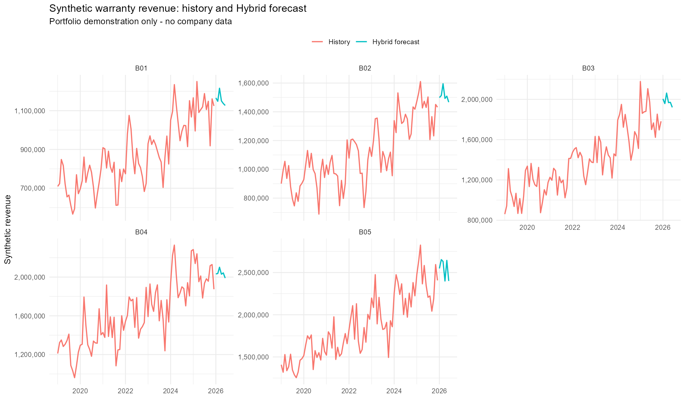
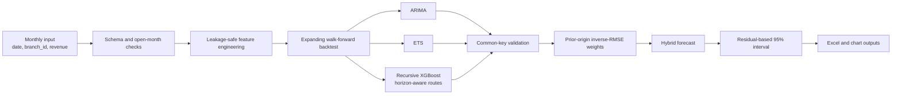

# Warranty Revenue Forecasting System

[](https://github.com/william4785-code/warranty-revenue-forecasting-system/actions/workflows/validation.yml)

An AI-assisted data science and model-engineering project for forecasting
monthly warranty revenue across multiple service branches.

Portfolio V2.2 combines ARIMA, ETS, and recursive XGBoost with time-aware
feature routing, walk-forward validation, leakage controls, independently
estimated Hybrid weights, prediction intervals, and explicit short-history
fallbacks.

> This is a sanitized portfolio implementation. All branch IDs, data,
> database names, and demonstration outputs are synthetic. There is no mapping
> between B01-B05 and any real service location.



## Why this project is difficult

Monthly warranty revenue is noisy, branch-specific, and affected by changing
claim volume, seasonality, operational timing, and occasional large cases.
A model can appear accurate while still being unusable if it:

- uses a feature that is unavailable at forecast time;
- evaluates different models on different months;
- tunes features on the same period later reported as a test;
- silently drops a model when Hybrid weights fail to join;
- treats a new branch as if it had years of history.

The primary goal of V2.2 is therefore not merely to fit a complex model. It is
to make every forecast traceable, time-valid, and safe to compare.

## What changed in Portfolio V2.2

- Removed same-month year-over-year growth features that leaked the target.
- Added a leakage blacklist and forecast-time availability rules.
- Excluded the current incomplete month before feature engineering.
- Standardized XGBoost model naming to `XGB`.
- Assigned horizons within each branch and model.
- Added common-key checks requiring ARIMA, ETS, and XGB for every evaluation
  row.
- Replaced silent `na.rm = TRUE` model dropping with explicit validation.
- Added horizon-aware XGBoost feature routes.
- Added a short-history fallback route.
- Estimated Hybrid backtest weights using only prior forecast origins.
- Estimated Hybrid interval scale from historical Hybrid residuals, preserving
  cross-model error correlation.
- Split the original monolithic script into testable modules.

See [CHANGELOG.md](CHANGELOG.md) for the version history.

## Forecasting architecture



## Model roles

| Model | Role | Main risk |
|---|---|---|
| ARIMA | Linear autocorrelation and differencing patterns | Misses nonlinear interactions |
| ETS | Level, trend, and seasonal smoothing | Can lag irregular structural shifts |
| XGBoost | Nonlinear lag, trend, volatility, and calendar interactions | Leakage and recursive error accumulation |
| Hybrid | Diversifies model-specific errors | Optimistic results if weights use the evaluation origin |

Simple models remain valid Champions when they outperform XGBoost or Hybrid on
the same walk-forward samples.

## Validation design

The system uses expanding-window walk-forward evaluation for horizons
`h = 1,...,6`.

For each forecast origin:

1. Only earlier months are used for training.
2. ARIMA, ETS, and XGBoost predict the same future branch-month-horizon keys.
3. Common-key validation rejects missing, duplicated, or inconsistent rows.
4. Hybrid weights are estimated from origins strictly earlier than the current
   evaluation origin.
5. RMSE is the primary ranking metric; MAE, MAPE, WAPE, Bias, and sample size
   are retained as supporting evidence.

Full methodology:
[docs/validation-methodology.md](docs/validation-methodology.md).

## Horizon-aware features

The public routing policy is illustrative and uses synthetic branch IDs:

| Route | Use | Feature family |
|---|---|---|
| `recursive_core` | Most branches, h=1-4 | Calendar, recursive revenue lags, rolling values, trend, growth, volatility |
| `safe_compact` | Most branches, h=5-6 | Core plus safe lag-6 and lag-12 signals |
| `recursive_core_guardrail` | Synthetic B02 | Conservative core route across all horizons |
| `recursive_core_short_history` | Synthetic B05 | Explicit reduced-history threshold |

No route contains same-month target growth or future operational counts.
See [docs/feature-availability.md](docs/feature-availability.md).

## Quick start: fully synthetic demo

Requirements:

- R 4.4 or later
- packages listed below

Recreate the recorded package environment:

```r
install.packages("renv")
renv::restore()
```

Or install the required packages directly:

```r
install.packages(c(
  "dplyr", "tidyr", "lubridate", "zoo", "xgboost", "forecast",
  "tibble", "ggplot2", "scales", "writexl", "testthat",
  "DBI", "RMariaDB"
))
```

Run from the repository root:

```r
source("scripts/run_demo.R", encoding = "UTF-8")
```

The demo:

- generates monthly synthetic data for B01-B05;
- performs multi-horizon walk-forward evaluation;
- creates prior-origin Hybrid weights;
- produces six-month forecasts and residual-based intervals;
- writes an Excel workbook and PNG chart under `outputs/demo/`.

The default demo uses fewer XGBoost rounds than the production reference so it
finishes quickly. Override with environment variables:

```text
DEMO_NROUNDS=80
DEMO_ORIGINS=6
DEMO_HORIZON=6
REPORT_OUTPUT_DIR=outputs/demo
```

## Run with your own sanitized data

CSV schema:

```text
date,branch_id,revenue
2025-01-01,B01,1250000
```

```text
INPUT_CSV=path/to/monthly_input.csv
REPORT_OUTPUT_DIR=outputs
```

```r
source("scripts/run_forecast.R", encoding = "UTF-8")
```

MariaDB configuration remains supported through `.env.example`. The configured
monthly table must expose the public columns `date`, `branch_id`, and
`revenue`.

## Project structure

```text
.
├── R/
│   ├── config.R
│   ├── data_validation.R
│   ├── feature_engineering.R
│   ├── models.R
│   ├── backtesting.R
│   ├── hybrid.R
│   ├── metrics.R
│   ├── io.R
│   ├── pipeline.R
│   └── synthetic_data.R
├── scripts/
│   ├── run_forecast.R
│   ├── run_demo.R
│   └── render_demo_assets.R
├── tests/testthat/
├── docs/
│   ├── model-card.md
│   ├── validation-methodology.md
│   ├── feature-availability.md
│   ├── data-dictionary.md
│   └── warranty-forecasting-technical-handbook.pdf
├── .github/workflows/validation.yml
├── CHANGELOG.md
└── renv.lock
```

## Documentation

- [Model Card](docs/model-card.md)
- [Validation Methodology](docs/validation-methodology.md)
- [Feature Availability and Leakage Controls](docs/feature-availability.md)
- [Public Data Dictionary](docs/data-dictionary.md)
- [Technical Review Handbook](docs/warranty-forecasting-technical-handbook.pdf)

## Tests

```r
source("tests/testthat.R", encoding = "UTF-8")
```

Tests cover:

- schema and duplicate-key validation;
- exclusion of the current incomplete month;
- leakage-free feature routes;
- horizon routing and short-history thresholds;
- common-key model completeness;
- prior-origin Hybrid weights;
- an end-to-end synthetic smoke test.

## Current limitations

- Synthetic results do not represent production performance.
- Recursive XGBoost can accumulate error at longer horizons.
- Residual-based intervals are an approximation and should be monitored for
  empirical coverage.
- The public routing policy demonstrates governance mechanics; it is not a
  universal policy for other businesses.
- Hyperparameter search is intentionally excluded from the production path
  until nested validation is applied to the final leakage-safe feature set.

## Data privacy

Do not commit:

- real warranty records or financial forecasts;
- internal branch mappings;
- credentials or database endpoints;
- generated company reports;
- private feature names or operational rules.

Use synthetic or irreversibly anonymized inputs for demonstrations.

## License

No open-source license has been selected yet. The repository is publicly
viewable, but reuse rights remain reserved until a license is explicitly added.
